# Bayesian Method for Data Science — UCI German Credit Dataset

**Course:** Bayesian Method for Data Science  
**Instructor:** Yuxiao Huang  
**Group 2:** Krystin Sinclair, Ye-in Jeon, Christian Cleber Masdeval Braz

---

## Dataset Overview

The data chosen for this project is the **UCI German Credit dataset**, comprising almost **1,000 observations** and **21 attributes**. The primary variable of interest is whether a client would be classified as **good credit or bad credit** (credit default). A secondary response variable is **credit amount**. The attributes include: checking account status, account duration, credit history, purpose of the loan, employment status, employment duration, savings amount, marital status, residence, age, and others.

Banks are interested in identifying which applicants will default; loan applicants are interested in how much they can request.

---

## Exploratory Data Analysis

Initial EDA was performed using R's `structure()` and `summary()` functions, followed by bar plots, correlation matrices, scatter plots, and boxplots.

**Bar plot — Gender by Credit Default** (credit_default = 1 means default, 0 means no default): more male applicants exist and the majority did not default.

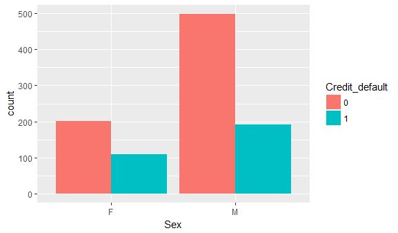

**Scatter plot — Duration vs. Credit Amount**: shows a positive correlation between loan duration and credit amount.

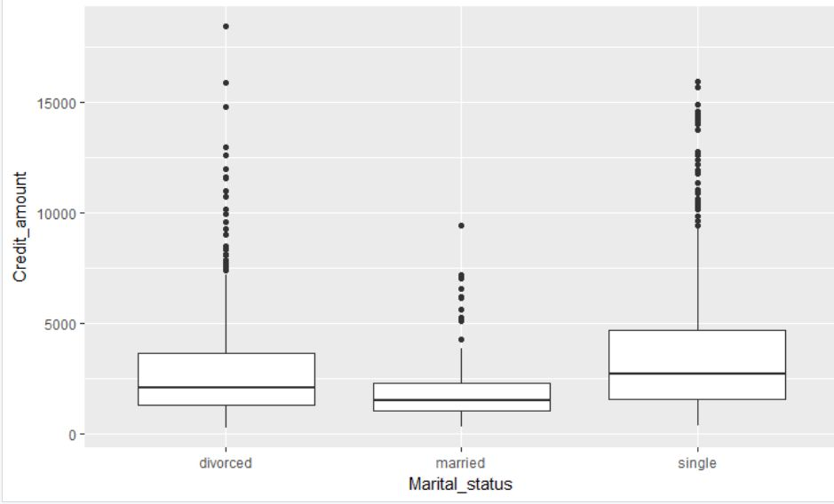

**Box plot — Marital Status vs. Credit Amount**: credit amount is fairly similar across single, divorced, and married applicants, though there is less variance among married individuals.

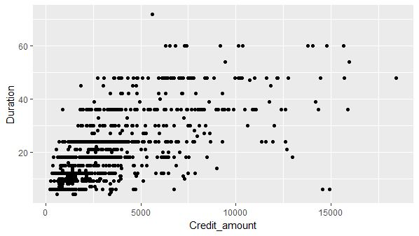

The **correlation matrix** confirms the highest correlation among all numerical attributes is **0.62**, between duration and credit amount.

---

## MCMC Analysis — Probability of Default by Category

MCMC was used to assess the likelihood of default across categories within categorical variables, providing both the probability of an individual defaulting and the tendency of a whole group.

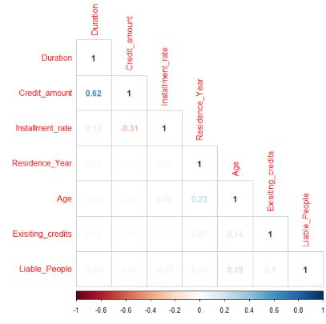

The figure below shows results for the **Purpose** category across four loan purposes:
- **Case 1** — Car (new)
- **Case 2** — Car (used)
- **Case 8** — Education
- **Case 9** — Retraining

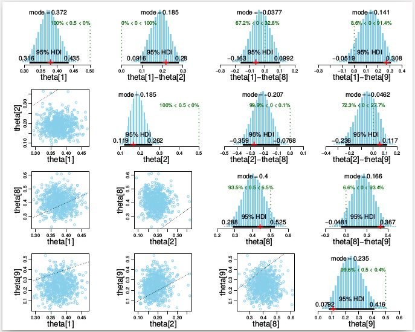

As expected, since the classes are unbalanced (70% non-defaulters, 30% defaulters), all modes are close to the overall default rate:

- **Case 1** (mode = 0.37): no shrinkage occurs — the posterior matches the raw data proportion (indicated by the red cross).
- **Case 9** (mode ≈ 0.14): noticeable shrinkage toward the group mode (0.3). The 95% HDI is broad due to sparse data for this subgroup, meaning the group-level metrics exert a strong influence.
- **Case 8** (mode ≈ 0.40): warrants special attention. Despite a wide HDI, it has the highest proportion of defaulters and is the only case with a credible probability above 0.5. Posterior estimates of differences between Case 8 and Cases 2 and 9 exclude zero even after shrinkage — reinforcing caution.

---

## MCMC Analysis — Five Categorical Features

Five categorical features with qualitative information about bank account holders, organized from highest to lowest mode of default probability:

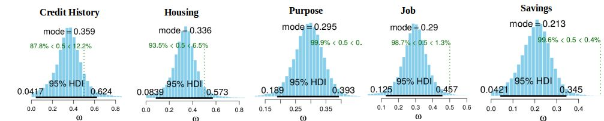

These features vary considerably across categories, and some concentrate more information about past defaulters — useful for identifying clients more prone to default.

---

## Classification: Frequentist vs. Bayesian Logistic Regression

### Frequentist Logistic Regression

A **logistic regression** model was fit using R's `glm` function:

| Metric | Value |
|---|---|
| Overall Accuracy | 73% |
| Precision | 0.63 |
| Recall | 0.44 |

In this context, **recall is more important than precision**: a bank is more concerned about false negatives (predicting a person is reliable when they are not) than false positives. To address this, the decision threshold can be lowered from 0.5 to 0.3 — increasing the false positive rate while decreasing the false negative rate.

### Bayesian Logistic Regression (JAGS / MCMC)

The Bayesian model estimates the posterior of the logistic coefficients via MCMC. The model was built to be robust against outliers through a **guessing variable**:

```r
model {
    for ( i in 1:Ntotal ) {
        # In JAGS, ilogit is logistic:
        y[i] ~ dbern( mu[i] )
        mu[i] <- ( guess*(1/2) + (1.0-guess)*ilogit(zbeta0+
                              sum(zbeta[1:Nx]*zx[i,1:Nx])) )
    }
    # Priors vague on standardized scale:
    zbeta0 ~ dnorm( 0 , 1/2^2 )
    for ( j in 1:Nx ) {
        zbeta[j] ~ dnorm( 0 , 1/2^2 )
    }
    guess ~ dbeta(1,9)
}
```

Predictions are made using the **sigmoid function** on the estimated coefficients, evaluated on the same train/test split as the frequentist model.

| Metric | Frequentist | Bayesian |
|---|---|---|
| Overall Accuracy | 73% | **80%** |
| Recall | 0.44 | **0.55** |
| Precision | 0.63 | **0.77** |

### ROC Curve Comparison

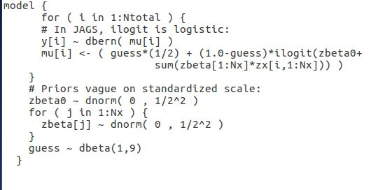

The ROC curve plots True Positive Rate (y-axis) against False Positive Rate (x-axis) across all thresholds. Both models have AUC > 0.5 (better than chance), with the Bayesian classifier slightly higher (0.812 vs. 0.788). The p-value of 0.095 indicates the difference is not statistically significant.

---

## Regression: Predicting Credit Amount

### Frequentist Linear Regression

An initial linear regression on all attributes yielded an **adjusted R² = 0.60**.

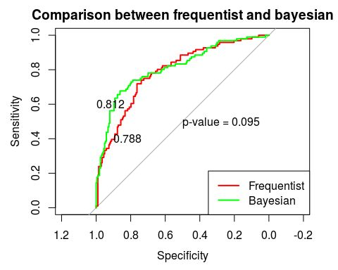

An **ANOVA test** (p-value threshold = 0.001) identified the six most important attributes:

1. Status checking
2. Duration
3. Purpose
4. Installment rate
5. Property
6. Job

A normality test on credit amount revealed heavy skewness:

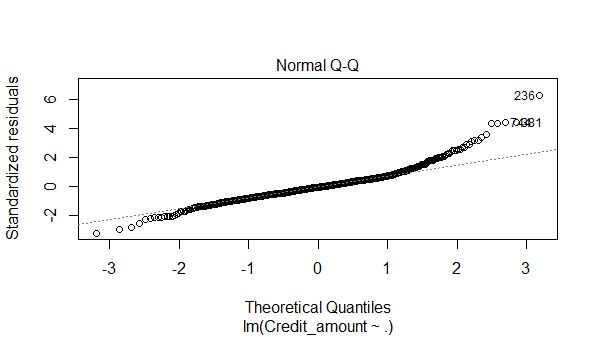

Applying a **log transformation** to the response variable improved normality. The final frequentist model using the six attributes and log(credit amount) achieved **adjusted R² = 0.63**.

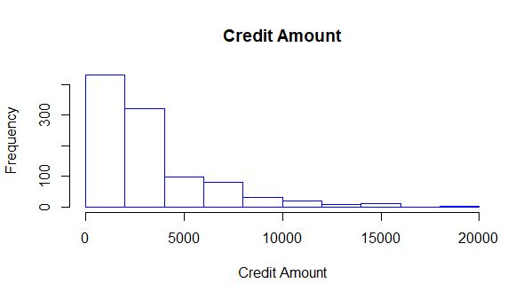

### Bayesian Regression

Four Bayesian model selection strategies were applied — **BPM**, **BMA**, **MPM**, and **HPM** — using the same six attributes with log(credit amount) as the response variable. **BPM** was selected as the best model based on RMSE.

| Model | RMSE |
|---|---|
| Frequentist (best) | 2,080.457 |
| **Bayesian BPM (best)** | **2,019.237** |

**Normal Q-Q plot — Bayesian BPM:**

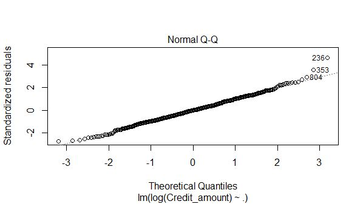

**Predicted vs. Actual Credit Amount — Bayesian BPM:**

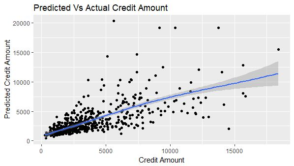

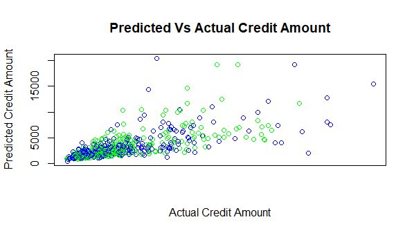

---

## Conclusion

Bayesian Analysis proved to be a more effective tool than the frequentist approach across both tasks:

- **Classification:** Bayesian logistic regression achieved 80% accuracy, recall of 0.55, and precision of 0.77 — all superior to the frequentist model.
- **Regression:** Bayesian BPM achieved a lower RMSE (2,019) than the best frequentist model (2,080).

Key actionable insights from the analysis:

**For banks:**
- Be wary of giving loans to the **unemployed**.
- Interestingly, **renters** are less likely to default than homeowners.

**For loan applicants:**
- Higher credit amounts are granted to those with **management or highly qualified jobs**.
- Loans for **car purchases** tend to have higher approved amounts.

For future research, Bayesian Analysis should continue to be utilized given its consistently superior performance in this domain.

---

## References

**Dataset**  
http://home.cse.ust.hk/~qyang/221/Assignments/German/

**Articles**  
- https://loans.usnews.com/beyond-credit-scores-factors-that-affect-a-loan-application  
- https://studentloanhero.com/featured/personal-loan-purpose-happens-change/  
- https://www.cbsnews.com/news/5-things-that-can-torpedo-your-mortgage-application/  
- http://www.ijbf.uum.edu.my/images/pdf/5no1ijbf/6ijbf51.pdf  
- https://www.sciencedirect.com/science/article/pii/0883902688900183  
- https://dl.acm.org/citation.cfm?id=131259  
- https://www.emeraldinsight.com/doi/pdfplus/10.1108/eb013696  
- http://www.rcmloan.com/credit-building-solana-beach-ca/
